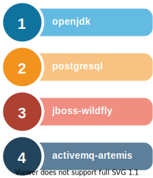

# docker


## Diagram



## Running via docker-compose and the docker-compose.yml

> to start in the background

```docker
docker-compose up -d
```

> to stop

```docker
docker-compose stop
```

> remove the container

```docker
docker-compose rm -f
```

> follow logs

```docker
docker-compose logs -f
```

> Quick stop, rm, start and then connect via exec bash

```docker
docker-compose stop && docker-compose rm -f &&  docker-compose up -d && docker-compose exec postgres bash
```

> Use exec command to execute scripts against the postgres service

```docker
docker-compose exec postgres bash /scripts/initdb.sh
```

## Using docker cli to build an image

> manage docker artifacts

```docker
# list all running docker containers
docker ps -a

# clean up all unused containers and images
docker container prune -f
docker image prune -a -f
```

> build an image in a directory with ``Dockerfile``

```docker
docker build --tag=oceanebelle/image .
```

> inspecting a built container, by running interactive bash

```docker
# interactive bash
docker run -it --rm -P --name test_image --entrypoint bash oceanebelle/openjdk
```

## Setting up local docker environment for multi architecture build

> Enable experimental option to use buildx

```docker
# In ~/.docker/config.json
{
        "experimental": "enabled",
        "currentContext": "remote"
}
```

> Setup docker builder and buildx

```docker
# list all context
docker context ls
# list all the context available
docker context inspect default

# create a docker contexts for all docker daemons
docker context create  node-armv7 --description "raspberry pi model 4" --docker host=tcp://pinya:2375
docker context create  node-amd64 --description "ubuntu wsl" --docker host=tcp://localhost:2375
docker context create  node-armv6 --description "raspberry pi zero" --docker host=tcp://enviro:2375

# create a new builder for buildx and add all the docker daemons created previously
# create and use the builder
docker buildx create --use    --name multibuilder node-amd64 --platform linux/amd64
docker buildx create --append --name multibuilder node-armv7 --platform linux/arm/v7
docker buildx create --append --name multibuilder node-armv6 --platform linux/arm/v6

# inspect the newly created builder and bootstrap it
docker buildx use multibuilder
docker buildx inspect multibuilder --bootstrap

# build accordingly, this build produces multiple target architecture
docker buildx build --platform linux/amd64,linux/arm/v7 .

# to remove the builder
docker buildx rm multibuilder

```
